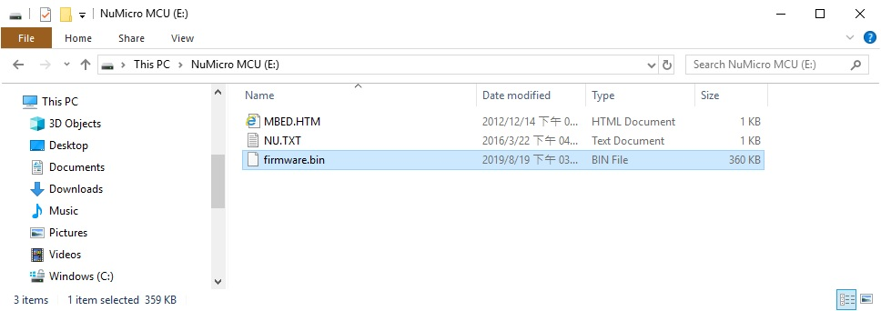
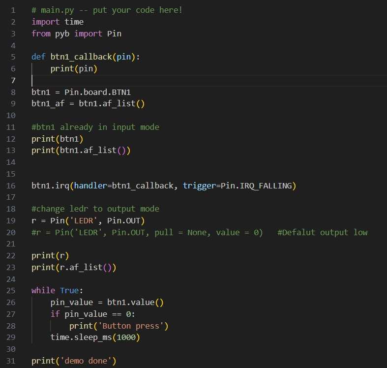

# NuMicroPy
NuMicroPy is Nuvoton microcontroller porting for MicroPython. MicroPython is a lean and efficient implementation of the Python 3 programming language that includes a small subset of the Python standard library and is optimised to run on microcontrollers and in constrained environments. See [MicroPython](http://micropython.org/)

----
## Major components in this repository
- M55M1/ -- M55M1 porting of MicroPython
- M5531/ -- M5531 porting of MicroPython
- build/ -- Prebuilt frimware
----
## Supported target
Board            |MCU      |Required ROM size     |Required RAM size
:----------------|---------|----------------------|------------------
NuMaker-M55M1    |M55M1    |342KB                 |350KB
NuMaker-M5531    |M5531    |342KB                 |350KB
----
## How to run NuMicroPy
1. Download and install [NuMicro ICP Programming Tool v3.20](https://www.nuvoton.com/tool-and-software/software-tool/programmer-tool/)
2. Hardware setup steps  
a. Turn on ICE function switch pin 1 and 2  
  
b. Connect ICE USB port to PC  
3. Burn firmware  
Nu-Link-Me exported a "NuMicro MCU" disk, just Copy and Paste prebuilt firmware.bin into "NuMicro MCU" disk.  

a. Connected FSUSB port to PC.  
b. Setup your terminal program  
  
  
c. Press the BTN0 + RESET button. Firmware will export a PYBFLASH disk.
  
d. Update your python code to boot.py or main.py
  
e. Press the RESET button.  
  
----
## How to build firmware
To develop firmware for MicroPython, it is best to use a Unix-like machine. (preferred on Unubtu 22.04).
1. Packages and toolchain installation  
Please following [install.txt](install.txt) instructions
2. Build firmware  
To build NuMicroPy firmare for M55M1, use the following command  
```
cd M55M1
make V=1
``` 
For M5531
```
cd M5531
make V=1   
``` 
